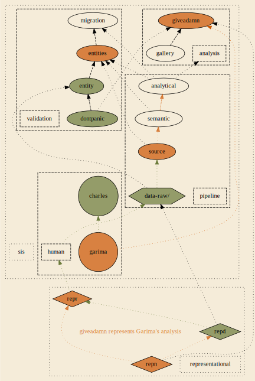

# Dr Gupta x Good Enough Lab

## What this project is for

- We want to help you with `the code bit` so you can focus on important science; that means making it easier for you to answer scientific questions. 
- We will not share any data or code until you decide what to publish, lots of development will be done with simulated data. 
- The Lab manage your projects and support needs by [issues](https://github.com/softloud/gg/issues), where you can comment and oversee, if you want to look into what we are working on.   

## Forking workflow

We are using this [forking workflow](https://www.atlassian.com/git/tutorials/comparing-workflows/forking-workflow) for sharing via git.

People at the Lab are always getting confused by git, we encourage you to reach out for support. 

## Structure of this project



```sh
cantabile@lappy486:~/Documents/repos/gg$ tree -L 1
.
├── analysis
├── data-raw
├── dot # dot-graph image scripts
├── local-data # where Charles stores original data dump
├── pipeline 
├── R
├── README.md # document you are reading
├── renv # package management
├── renv.lock # package management 
└── validation

9 directories, 2 files
```

### Configured not to send to cloud

- `renv/`
- `data-raw/`
- `local-data/`

See `.gitignore` for more details.

### Directories & Files


system diagram | dir | file name | description | input | output | observer
--- |--- | --- | --- | --- | --- | ---
`dontpanic` | validation | `dontpanic.Rmd` | No input. | No output. | Dr Gupta.
`entity` | validation | `fair-data-entity.Rmd` | FAIR data entity test (QAO paper), unique & not null on a single row of one entities | table. | One table copied into `data-raw/`. | No output. | Dr Gupta  
`entities` | validation | `fair-data-validation.Rmd` | Our shared assumptions and confirmations about data. | All source tables provided. | No output. | Dr Gupta
`migration`| validation | `fair-analysis-migration.Rmd` | | `local_data/entity_*.csv` and `local_data/ao_*.csv` | No output. | Dr Gupta
`staging` | pipeline | `fair-staging.Rmd` | FAIR staging | raw files as provided | `data-raw/staging_*.csv` tables. | Dr Gupta 
`semantic`| pipeline | `fair-semantic-transformation.Rmd` | FAIR transformation | fair-staging output as computational objects | tables whose rows are uniquely identified by semantic identities (SDG, responses, respondents, geographic metadata) `data-raw/entity_*.csv` | Dr Gupta 
`analytical` | pipeline | `fair-analytical-observations.Rmd` | FAIR analytical observation: plot-specific tables | fair-semantic-transformation output | Tables for specific analyses, `data-raw/ao_*.csv`| Dr Gupta 
 | R | `*.R` |A place to document data sets in `roxygen` and store helper functions. | Source functions, and the basis of a packaged analysis with data in R. | potentially anywhere in pipeline | Functions to source. | Lab

#### valildation/

In the validation directory, you will find .Rmd files associated with the validation workflow.

#### analysis/

Home to manuscript and gallery, slide decks, etc.

#### pipeline/

Data transformation.

#### Development strategy: FAIR analysis

Our priority is to make the analysis FAIR to Dr Gupta, while also helping with the `the code bit`: findable, accessible, interoperable, reusable. There's lots of detail on the website, but I tend to find that people pile so much complexity on the analysis downstream, the architecture is always on fire, and thus we do not ever achieve bare minimum FAIR for the analyst who matters the most. 

Hence I am running with the loosest definitions of FAIR here, just the words themselves, not all the subprotocols. Dr Gupta must be able to find, access, interoperate, and reuse analysis components. Dr Gupta is always invited to request we fulfill one of the requirements as a priority, otherwise we mosey toward  being truly FAIR. Gotta start somewhere.  

Now Dr Gupta will need to publish her analysis as FAIR at publication, so we can then develop these analyses into front-facing later on, and reduce an unnecessary skill demand of Dr Gupta, an ecologist. 

This is also a sketch of a living analysis pipeline design, so we can aggregate Dr Gupta's knowledge base for her down the line. Yeah, I will totally spin up a DBT architecture for this soon enough. We will migrate from the .Rmd scripts to helpers as needed. 

## Known problem

Data extraction requires geographic entities and displacement status. 

Kobo extraction refactoring will make this much easier to tweak. 

This is the first big issue to solve. 

## Validations

### `dontpanic` test

Display `42` on Dr Gupta's screen to check workflow functionality.

### FAIR data entity test

`fair-data-entity.Rmd` is a FAIR data entity test; this serves a few functions, the most of important of which is ensuring you can run and extend scripts the Lab writes for you in a way that makes sense to you and isn't too annoying at your end. 

#### Migration of existing project

Once we have a FAIR data entity test working at your end, we migrate an existing project--probably one of the bar plots. We prioritise this over any new analysis. 

## Data entities and analytical observations

A data entity represents a variable of interest in the analysis. This might be geographic region or respondent id. 

Various `.csv` files will be output by the pipeline to `data-raw/`. 

- `staging_*.csv` indicate cleaned up raw entities
- `entity_*.csv` indicate one row per entity
- `ao_*.csv` indicate an input created for a specific analysis, and rich data entities with common joins

These are your cleaned up datasets that you can load and explore. See the file structure table for where to find the scripts for each.

### data-raw 

Your data is secure. The `.gitignore` setting will prevent this data from being sent to the cloud repository. 

## Get started

These steps will help you get the project running on your local Windows machine.

### 1. Install R and RStudio

- Install R: [https://cran.r-project.org](https://cran.r-project.org)
- Install RStudio (free version): [https://posit.co/download/rstudio-desktop](https://posit.co/download/rstudio-desktop)

### 2. Get the project

You can either:

- **Option A: Clone the repo**
  1. Install [Git for Windows](https://git-scm.com/)
  2. Open Git Bash or the RStudio terminal, then run:
     ```bash
     git clone https://github.com/softloud/gg.git
     ```

- **Option B: Download as ZIP**
  1. Click “Code” → “Download ZIP” on the GitHub repo
  2. Extract the ZIP file to your preferred folder

### 3. Open the project

- Open RStudio
- Click “File” → “Open Project…” and select the `.Rproj` file in the folder

### 4. Load your data

- Create a folder called `data-raw` inside the project
- Save your data files into that folder. It is already `.gitignore`d, so your data will stay private

### 5. Restore the environment with `renv`

This project uses [`renv`](https://rstudio.github.io/renv/) to manage packages.

In the RStudio Console, run:

```r
install.packages("renv")
renv::restore()
```

### 6. Test your workflow

Open `validation/dontpanic.Rmd` and try knitting it. 

Do you see `42` in the output? Does the document knit?

